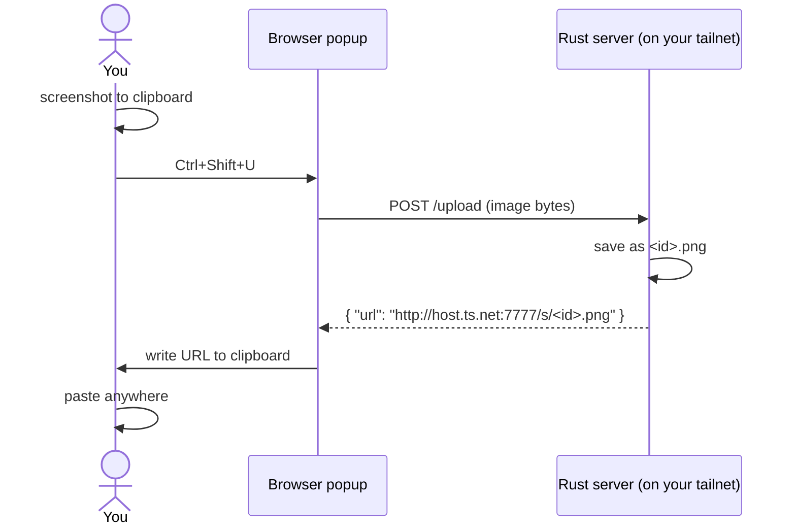

# tailscale-screenshot

Built this because I kept dragging PNGs into Slack and Discord one at a time
like an animal. Now I copy a screenshot, hit `Ctrl+Shift+U`, and a URL lands
on my clipboard. Paste it. Done.

The server is a single static Rust binary running on a box in my tailnet. It
guards uploads with a Basic-auth password (default `changeme`, override with
`PASSWORD`) so it's safe to put behind a public HTTPS proxy too. No TLS of its
own, no database — terminate TLS at the proxy (or stay on the tailnet).

## How it works



The popup reads the clipboard, posts the bytes, gets a URL back, and writes
that URL to the clipboard. The server gives the file a short random id and
serves it from disk with the right `Content-Type`.

## Server

You need `rustup`, `tailscale`, and [`smdctl`][smdctl] on the host. From the
repo root:

```
make install
```

That builds a release binary against musl, drops it in `~/.local/bin`, and
registers it as a user-mode systemd service through smdctl. Port 7777, so no
sudo. On startup the server logs its Tailscale URL — that's what you paste
into the extension.

To pull the URL out without scrolling logs:

```
make url
```

Other things you might want:

```
make logs       # follow the journal
make status
make restart
make uninstall
```

User-mode services stop when you log out unless you tell systemd otherwise:

```
loginctl enable-linger $USER
```

### Release Binary

Tagged GitHub releases include a ready-to-run Linux arm64 server binary:

```
tailscale-screenshot-linux-arm64
```

On the target Linux arm64 machine:

```
install -m 755 tailscale-screenshot-linux-arm64 ~/.local/bin/tailscale-screenshot
PORT=7777 DATA_DIR=$HOME/.local/share/tailscale-screenshot PASSWORD=change-this \
  ~/.local/bin/tailscale-screenshot
```

The binary is built for `aarch64-unknown-linux-musl` and checked as statically
linked in CI.

[smdctl]: https://github.com/nexo-tech/smdctl

## Extension

One MV3 codebase, two browsers. `extension/src/` holds the shared popup;
`manifest.chrome.json` and `manifest.firefox.json` are the per-browser
manifests. The build copies the shared files plus the right manifest into
`extension/build/<browser>/`, and packaging zips that up into
`extension/dist/`.

```
make ext-build            # unpacked dirs in build/ AND packages in dist/:
                          #   dist/tailscale-screenshot.xpi        (firefox)
                          #   dist/tailscale-screenshot-chrome.zip (chrome)
make ext-unpacked         # only the unpacked dirs (fast; skips packaging)
```

You need `node`/`npm` (for `web-ext`, pulled on demand via `npx`).

### Chrome

1. `make ext-build-chrome`  (or `make ext-unpacked-chrome` for just the dir)
2. Go to `chrome://extensions`, flip on Developer mode.
3. Load unpacked, pick `extension/build/chrome`.
4. Pin it from the puzzle-piece menu so the shortcut works without the popup hidden.
5. Open the popup, click the gear, paste the URL from `make url`, click off the field.
6. If `Ctrl+Shift+U` collides with something, rebind it at `chrome://extensions/shortcuts`.

### Firefox (Developer Edition)

For day-to-day work, just live-dev it — this launches Firefox Developer
Edition with the extension loaded and reloads on every save:

```
make ext-watch
```

(Override the binary with `FIREFOX_BIN=/path/to/firefox make ext-watch` if it
isn't at `/Applications/Firefox Developer Edition.app`.)

To produce the installable `.xpi`:

```
make ext-build-firefox        # one-off  -> extension/dist/tailscale-screenshot.xpi
make ext-watch-xpi            # rebuild the .xpi on every source change
```

Installing the `.xpi` in Developer Edition:

- **Temporary** (gone on restart, no signing): `about:debugging#/runtime/this-firefox`
  → *Load Temporary Add-on* → pick the `.xpi` (or `extension/build/firefox/manifest.json`).
- **Persistent unsigned install**:
  1. Open Firefox Developer Edition.
  2. Go to `about:config`.
  3. Set `xpinstall.signatures.required` to `false`.
  4. Go to `about:addons`, open the gear menu, choose *Install Add-on From File*,
     and select `tailscale-screenshot.xpi`.

That preference is intentionally available in Firefox Developer Edition,
Firefox Nightly, and unbranded builds. Regular Firefox release builds still
require signed add-ons for persistent installs.

The keyboard shortcut lives at `about:addons` → gear → *Manage Extension
Shortcuts* if `Ctrl+Shift+U` is taken.

### GitHub Release Flow

CI runs on pushes to `main` and pull requests. It checks:

```
cargo fmt
cargo clippy -D warnings
cargo test
cargo build --release --target aarch64-unknown-linux-musl
web-ext lint
make ext-build-firefox
make ext-build-chrome
```

Create a release by pushing a version tag:

```
git tag v0.1.0
git push origin v0.1.0
```

The release workflow publishes:

```
tailscale-screenshot.xpi              # Firefox Developer Edition package
tailscale-screenshot-chrome.zip       # Chrome package
tailscale-screenshot-linux-arm64      # static Linux arm64 server binary
```

Download `tailscale-screenshot.xpi` from the GitHub release, apply the
Developer Edition preference above, and install it from `about:addons`.

## Auth

`POST /upload` requires HTTP Basic auth. The password comes from the `PASSWORD`
env var and defaults to the deliberately-insecure `changeme` so it works out of
the box — set `PASSWORD` to something real, especially if the server is exposed
beyond your tailnet. The username is ignored; only the password is checked.

Set the same password in the extension (gear → Password). Reads (`GET /s/<id>`)
stay public so the URLs you paste remain fetchable by whatever consumes them.

## API

In case you want to script around it:

```
POST /upload                          (requires Basic auth)
  Authorization: Basic base64(user:<password>)
  Content-Type: image/{png,jpeg,gif,webp}
  body: raw image bytes (10 MB cap)
  -> 200 { "url": "...", "id": "..." }
  -> 401 if the password is wrong/missing

GET  /s/<id>.<ext>     the image, with the right Content-Type (public)
GET  /healthz          "ok" (public)
```

`curl` example:

```
curl -u :changeme -X POST -H 'Content-Type: image/png' \
     --data-binary @shot.png \
     https://host.tail-XXXX.ts.net/upload
```

## Config

All optional, all env vars:

| var        | default                                | what it does                              |
|------------|----------------------------------------|-------------------------------------------|
| `PORT`     | `7777`                                 | port to listen on                         |
| `DATA_DIR` | `./screenshots` (Makefile overrides)   | where files are written                   |
| `PASSWORD` | `changeme`                             | Basic-auth password for `/upload`         |
| `BASE_URL` | derived per-request from `Host`/`X-Forwarded-*` | pin the advertised URL instead   |

`BASE_URL` is now optional: when unset, each upload response advertises a URL
built from how the request arrived (scheme + host), so links are correct whether
you hit the server over the tailnet (`http://host:7777`) or a public HTTPS proxy
(`https://...`). Set `BASE_URL` only to force one fixed value.

Set the password at install time with `make install PASSWORD=...`.

## Layout

```
server/                    one main.rs, axum, ~150 lines
extension/
  src/                     shared MV3 popup (html/js/css)
  manifest.chrome.json     chrome manifest
  manifest.firefox.json    firefox manifest (gecko id, min version)
  scripts/                 build / package / dev-run helpers
  build/  dist/            generated (gitignored)
smdctl.yml                 service descriptor (Makefile fills in the paths)
Makefile                   build + smdctl + extension wrappers
```

## Things it deliberately doesn't do

No signed URLs, no expiry, no garbage collection, no upload history, no drag
and drop. Auth is a single shared password, not per-user tokens, and reads are
unauthenticated by design. If you want any of that, it's a couple hours of
work, but I don't.
