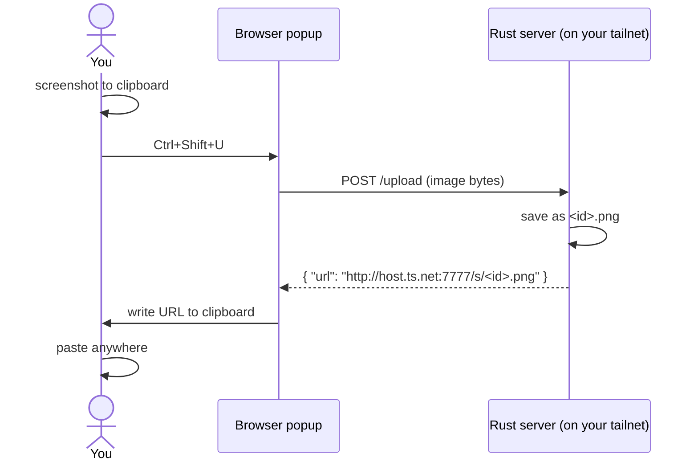

# tailscale-screenshot

Built this because I kept dragging PNGs into Slack and Discord one at a time
like an animal. Now I copy a screenshot, hit `Ctrl+Shift+U`, and a URL lands
on my clipboard. Paste it. Done.

The server is a single static Rust binary running on a box in my tailnet, so
the only people who can reach it are me on my other devices. No auth, no TLS,
no database. Tailscale is the perimeter.

## How it works



The popup reads the clipboard, posts the bytes, gets a URL back, and writes
that URL to the clipboard. The server gives the file a short random id and
serves it from disk with the right `Content-Type`.

## Server

You need `rustup`, `tailscale`, and [`smdctl`][smdctl] on the host. From the
repo root:

```
make install
```

That builds a release binary against musl, drops it in `~/.local/bin`, and
registers it as a user-mode systemd service through smdctl. Port 7777, so no
sudo. On startup the server logs its Tailscale URL — that's what you paste
into the extension.

To pull the URL out without scrolling logs:

```
make url
```

Other things you might want:

```
make logs       # follow the journal
make status
make restart
make uninstall
```

User-mode services stop when you log out unless you tell systemd otherwise:

```
loginctl enable-linger $USER
```

[smdctl]: https://github.com/nexo-tech/smdctl

## Extension

One MV3 codebase, two browsers. `extension/src/` holds the shared popup;
`manifest.chrome.json` and `manifest.firefox.json` are the per-browser
manifests. The build copies the shared files plus the right manifest into
`extension/build/<browser>/`, and packaging zips that up into
`extension/dist/`.

```
make ext-build            # unpacked dirs in build/ AND packages in dist/:
                          #   dist/tailscale-screenshot.xpi        (firefox)
                          #   dist/tailscale-screenshot-chrome.zip (chrome)
make ext-unpacked         # only the unpacked dirs (fast; skips packaging)
```

You need `node`/`npm` (for `web-ext`, pulled on demand via `npx`).

### Chrome

1. `make ext-build-chrome`  (or `make ext-unpacked-chrome` for just the dir)
2. Go to `chrome://extensions`, flip on Developer mode.
3. Load unpacked, pick `extension/build/chrome`.
4. Pin it from the puzzle-piece menu so the shortcut works without the popup hidden.
5. Open the popup, click the gear, paste the URL from `make url`, click off the field.
6. If `Ctrl+Shift+U` collides with something, rebind it at `chrome://extensions/shortcuts`.

### Firefox (Developer Edition)

For day-to-day work, just live-dev it — this launches Firefox Developer
Edition with the extension loaded and reloads on every save:

```
make ext-watch
```

(Override the binary with `FIREFOX_BIN=/path/to/firefox make ext-watch` if it
isn't at `/Applications/Firefox Developer Edition.app`.)

To produce the installable `.xpi`:

```
make ext-build-firefox        # one-off  -> extension/dist/tailscale-screenshot.xpi
make ext-watch-xpi            # rebuild the .xpi on every source change
```

Installing the `.xpi` in Developer Edition:

- **Temporary** (gone on restart, no signing): `about:debugging#/runtime/this-firefox`
  → *Load Temporary Add-on* → pick the `.xpi` (or `extension/build/firefox/manifest.json`).
- **Persistent**: Developer Edition allows unsigned add-ons if you set
  `xpinstall.signatures.required` to `false` in `about:config`, then open the
  `.xpi` from `about:addons` (gear → *Install Add-on From File*).

The keyboard shortcut lives at `about:addons` → gear → *Manage Extension
Shortcuts* if `Ctrl+Shift+U` is taken.

## API

In case you want to script around it:

```
POST /upload
  Content-Type: image/{png,jpeg,gif,webp}
  body: raw image bytes (10 MB cap)
  -> 200 { "url": "...", "id": "..." }

GET  /s/<id>.<ext>     the image, with the right Content-Type
GET  /healthz          "ok"
```

`curl` example:

```
curl -X POST -H 'Content-Type: image/png' \
     --data-binary @shot.png \
     http://host.tail-XXXX.ts.net:7777/upload
```

## Config

All optional, all env vars:

| var        | default                                | what it does                    |
|------------|----------------------------------------|---------------------------------|
| `PORT`     | `7777`                                 | port to listen on               |
| `DATA_DIR` | `./screenshots` (Makefile overrides)   | where files are written         |
| `BASE_URL` | auto-detected from `tailscale status`  | override the URL it advertises  |

## Layout

```
server/                    one main.rs, axum, ~150 lines
extension/
  src/                     shared MV3 popup (html/js/css)
  manifest.chrome.json     chrome manifest
  manifest.firefox.json    firefox manifest (gecko id, min version)
  scripts/                 build / package / dev-run helpers
  build/  dist/            generated (gitignored)
smdctl.yml                 service descriptor (Makefile fills in the paths)
Makefile                   build + smdctl + extension wrappers
```

## Things it deliberately doesn't do

No auth tokens, no signed URLs, no expiry, no garbage collection, no upload
history, no drag and drop, no Tailscale Funnel. If you want any of that,
it's a couple hours of work, but I don't.
